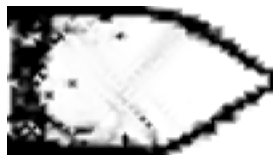
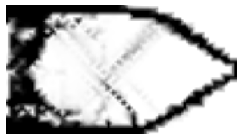
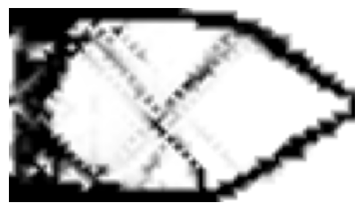
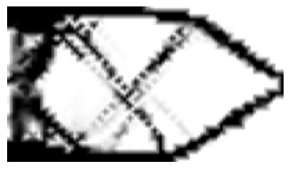
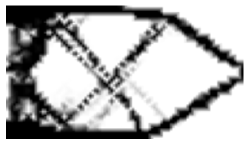
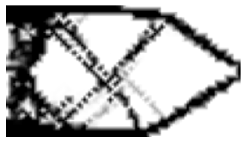
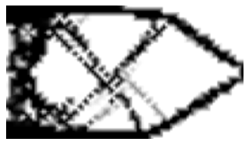
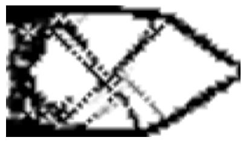

# SIMP method (topology optimization)
SIMP - Solid Isotropic Material with Penalty

## Example
Minimization of compliance (Maximization of ridigity)

For the FEA, Lisa 8.0 is used.

### Parameters
```
a = 0.375 # Target: V_final = a*V0
E0 = 200e9 # Initial Young's modulus
n = 2 # Penalty
nu = 0.3 # Poisson's ratio 
```











